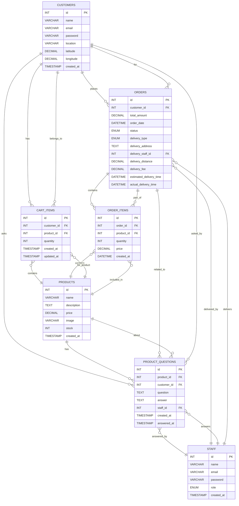

# E-Commerce Project: Database & ER Diagram Documentation

## System Overview
This document describes the database structure and entity relationships for the e-commerce application. The system supports customers, staff (with delivery and product manager roles), products, orders, cart, and a Q&A system.

---

## ER Diagram

---

## Table Descriptions

### CUSTOMERS
- **id**: Primary key
- **name**: Customer's full name
- **email**: Unique email address
- **password**: Hashed password
- **location**: Address
- **latitude/longitude**: Geocoded coordinates for delivery
- **created_at**: Registration timestamp

### STAFF
- **id**: Primary key
- **name**: Staff name
- **email**: Unique email
- **password**: Hashed password
- **role**: 'delivery' or 'product_manager'
- **created_at**: Registration timestamp

### PRODUCTS
- **id**: Primary key
- **name**: Product name
- **description**: Product details
- **price**: Price (decimal)
- **image**: Image path
- **stock**: Inventory count
- **created_at**: Timestamp

### PRODUCT_QUESTIONS
- **id**: Primary key
- **product_id**: FK to PRODUCTS
- **customer_id**: FK to CUSTOMERS
- **question**: Customer's question
- **answer**: Staff's answer
- **staff_id**: FK to STAFF (who answered)
- **created_at**: When asked
- **answered_at**: When answered

### ORDERS
- **id**: Primary key
- **customer_id**: FK to CUSTOMERS
- **total_amount**: Order total
- **order_date**: Date/time
- **status**: Order status (Pending, Processing, etc.)
- **delivery_type**: 'delivery' or 'pickup'
- **delivery_address**: Address for delivery
- **delivery_staff_id**: FK to STAFF (delivery)
- **delivery_distance**: Distance in km
- **delivery_fee**: Fee for delivery
- **estimated_delivery_time**: ETA
- **actual_delivery_time**: When delivered

### ORDER_ITEMS
- **id**: Primary key
- **order_id**: FK to ORDERS
- **product_id**: FK to PRODUCTS
- **quantity**: Number of units
- **price**: Price per unit
- **created_at**: Timestamp

### CART_ITEMS
- **id**: Primary key
- **customer_id**: FK to CUSTOMERS
- **product_id**: FK to PRODUCTS
- **quantity**: Number of units
- **created_at**: Timestamp
- **updated_at**: Timestamp

---

## Relationships
- **A customer** can have many orders, cart items, and product questions.
- **A staff member** can answer many questions and deliver many orders.
- **A product** can have many questions, be in many order items, and many cart items.
- **An order** contains many order items and is placed by a customer.
- **Order items** link orders and products.
- **Cart items** link customers and products.
- **Product questions** link customers, products, and (optionally) staff.

---

## Legend
- **PK**: Primary Key
- **FK**: Foreign Key
- **||--o{**: One-to-many relationship
- **}o--||**: Many-to-one relationship

---

## Notes
- All passwords are securely hashed.
- Delivery is only available within 5km of the warehouse (Kochi).
- The Q&A system allows customers to ask questions and staff to answer.
- The system supports both delivery and pickup orders.

---

For any further details, see the SQL schema or contact the project maintainer. 

<svg width="1200" height="900" viewBox="0 0 1200 900" xmlns="http://www.w3.org/2000/svg">
  <rect width="1200" height="900" fill="#fff"/>
  <g font-family="Segoe UI, Arial, sans-serif" font-size="16">
    <!-- Entities -->
    <rect x="40" y="40" width="220" height="180" fill="#e8f4fd" stroke="#185a9d" stroke-width="2"/>
    <text x="60" y="70" font-weight="bold">CUSTOMERS</text>
    <text x="60" y="100">id (PK)</text>
    <text x="60" y="120">name</text>
    <text x="60" y="140">email</text>
    <text x="60" y="160">password</text>
    <text x="60" y="180">location</text>
    <text x="60" y="200">latitude</text>
    <text x="60" y="220">longitude</text>
    <text x="60" y="240">created_at</text>

    <rect x="500" y="40" width="220" height="120" fill="#e8f4fd" stroke="#185a9d" stroke-width="2"/>
    <text x="520" y="70" font-weight="bold">STAFF</text>
    <text x="520" y="100">id (PK)</text>
    <text x="520" y="120">name</text>
    <text x="520" y="140">email</text>
    <text x="520" y="160">password</text>
    <text x="520" y="180">role</text>
    <text x="520" y="200">created_at</text>

    <rect x="900" y="40" width="220" height="160" fill="#e8f4fd" stroke="#185a9d" stroke-width="2"/>
    <text x="920" y="70" font-weight="bold">PRODUCTS</text>
    <text x="920" y="100">id (PK)</text>
    <text x="920" y="120">name</text>
    <text x="920" y="140">description</text>
    <text x="920" y="160">price</text>
    <text x="920" y="180">image</text>
    <text x="920" y="200">stock</text>
    <text x="920" y="220">created_at</text>

    <rect x="40" y="320" width="260" height="120" fill="#e8f4fd" stroke="#185a9d" stroke-width="2"/>
    <text x="60" y="350" font-weight="bold">CART_ITEMS</text>
    <text x="60" y="380">id (PK)</text>
    <text x="60" y="400">customer_id (FK)</text>
    <text x="60" y="420">product_id (FK)</text>
    <text x="60" y="440">quantity</text>
    <text x="60" y="460">created_at</text>
    <text x="60" y="480">updated_at</text>

    <rect x="900" y="320" width="260" height="120" fill="#e8f4fd" stroke="#185a9d" stroke-width="2"/>
    <text x="920" y="350" font-weight="bold">ORDER_ITEMS</text>
    <text x="920" y="380">id (PK)</text>
    <text x="920" y="400">order_id (FK)</text>
    <text x="920" y="420">product_id (FK)</text>
    <text x="920" y="440">quantity</text>
    <text x="920" y="460">price</text>
    <text x="920" y="480">created_at</text>

    <rect x="500" y="320" width="260" height="180" fill="#e8f4fd" stroke="#185a9d" stroke-width="2"/>
    <text x="520" y="350" font-weight="bold">ORDERS</text>
    <text x="520" y="380">id (PK)</text>
    <text x="520" y="400">customer_id (FK)</text>
    <text x="520" y="420">total_amount</text>
    <text x="520" y="440">order_date</text>
    <text x="520" y="460">status</text>
    <text x="520" y="480">delivery_type</text>
    <text x="520" y="500">delivery_address</text>
    <text x="520" y="520">delivery_staff_id (FK)</text>
    <text x="520" y="540">delivery_distance</text>
    <text x="520" y="560">delivery_fee</text>
    <text x="520" y="580">estimated_delivery_time</text>
    <text x="520" y="600">actual_delivery_time</text>

    <rect x="40" y="600" width="340" height="120" fill="#e8f4fd" stroke="#185a9d" stroke-width="2"/>
    <text x="60" y="630" font-weight="bold">PRODUCT_QUESTIONS</text>
    <text x="60" y="660">id (PK)</text>
    <text x="60" y="680">product_id (FK)</text>
    <text x="60" y="700">customer_id (FK)</text>
    <text x="60" y="720">question</text>
    <text x="60" y="740">answer</text>
    <text x="60" y="760">staff_id (FK)</text>
    <text x="60" y="780">created_at</text>
    <text x="60" y="800">answered_at</text>

    <!-- Relationships (arrows/lines) -->
    <line x1="150" y1="220" x2="150" y2="320" stroke="#185a9d" stroke-width="2" marker-end="url(#arrow)"/>
    <line x1="630" y1="220" x2="630" y2="320" stroke="#185a9d" stroke-width="2" marker-end="url(#arrow)"/>
    <line x1="1010" y1="220" x2="1010" y2="320" stroke="#185a9d" stroke-width="2" marker-end="url(#arrow)"/>
    <line x1="300" y1="380" x2="500" y2="380" stroke="#185a9d" stroke-width="2" marker-end="url(#arrow)"/>
    <line x1="760" y1="380" x2="900" y2="380" stroke="#185a9d" stroke-width="2" marker-end="url(#arrow)"/>
    <line x1="150" y1="440" x2="150" y2="600" stroke="#185a9d" stroke-width="2" marker-end="url(#arrow)"/>
    <line x1="1010" y1="440" x2="1010" y2="600" stroke="#185a9d" stroke-width="2" marker-end="url(#arrow)"/>
    <line x1="630" y1="500" x2="630" y2="600" stroke="#185a9d" stroke-width="2" marker-end="url(#arrow)"/>
    <line x1="760" y1="500" x2="900" y2="500" stroke="#185a9d" stroke-width="2" marker-end="url(#arrow)"/>
    <line x1="300" y1="700" x2="500" y2="700" stroke="#185a9d" stroke-width="2" marker-end="url(#arrow)"/>
    <line x1="760" y1="700" x2="900" y2="700" stroke="#185a9d" stroke-width="2" marker-end="url(#arrow)"/>
  </g>
  <defs>
    <marker id="arrow" markerWidth="10" markerHeight="10" refX="10" refY="5" orient="auto" markerUnits="strokeWidth">
      <path d="M0,0 L10,5 L0,10 L2,5 z" fill="#185a9d"/>
    </marker>
  </defs>
</svg> 